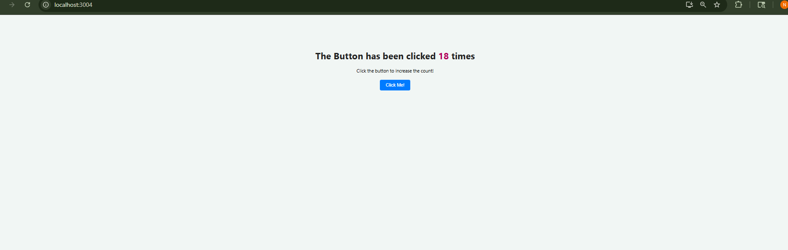

# Click Counter React App

This is a simple **React Click Counter** application that increases the count every time the button is clicked. It demonstrates the use of React hooks (`useState`) and basic JSX layout.

---

## Screenshot



---

## Features

- Count displayed dynamically
- React functional components with hooks

---

## How to Run Locally

1. **Clone the repository:**

```bash
git clone https://github.com/tnikhilchowdary/click-counter.git
